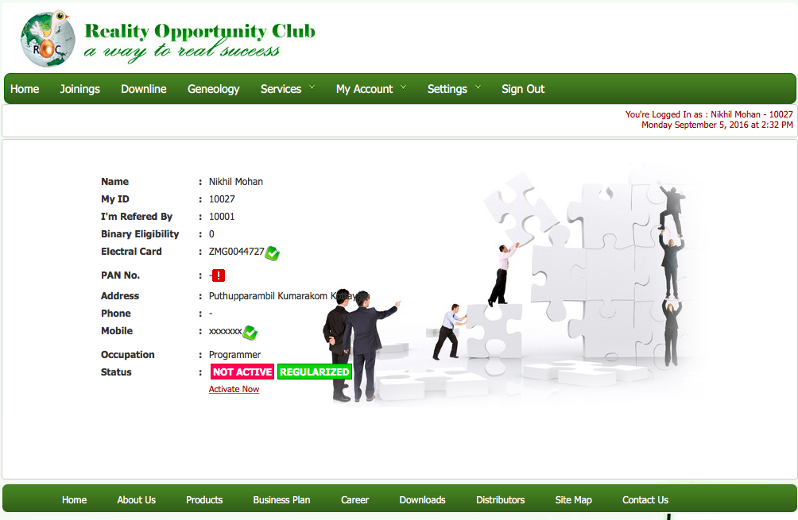
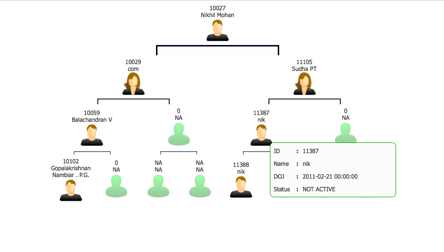
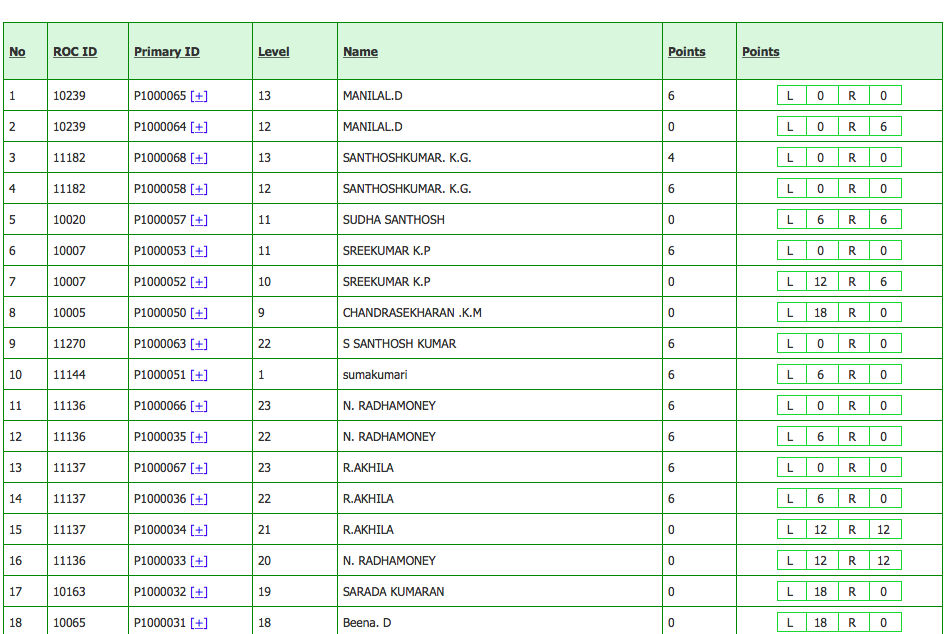
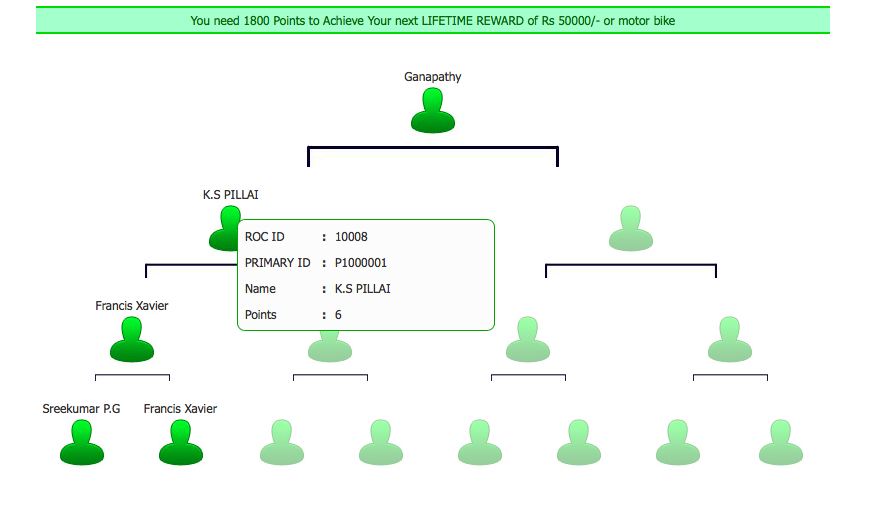

#  Reality Opportunity Club
Reality Opportunity Club (ROC) is MLM venture formed and promoted by a group of enthusiastic and enterprising youngsters from Kottayam, the literacy city of India. It is anchored by an extra ordinary force of its beckoning and ever growing Real-Member-Distributors. The Chief Navigator and Captain of this dream-ship is a stalwart in Direct Marketing business and United Customer's Programme (UCP), who excelled in this avenue for the last few years. ROC offers customer-oriented quality products ranging from common, necessary items to most innovative and specialty items at reasonable and affordable prices and an opportunity to earn income through the system.

## What?
This is my first project in PHP. 

## Screenshots

[Business Plan](downs/Business-Plan-RealityOpportunityClub.pdf)
